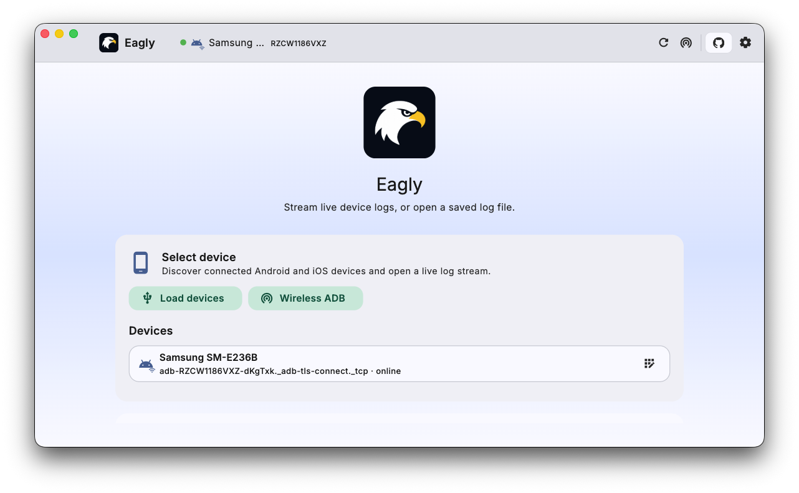
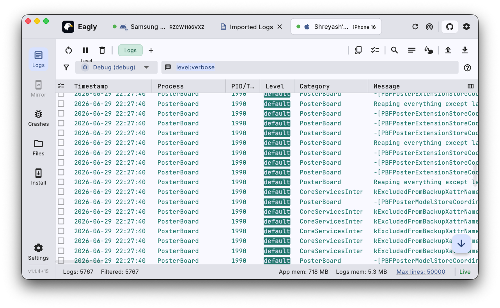
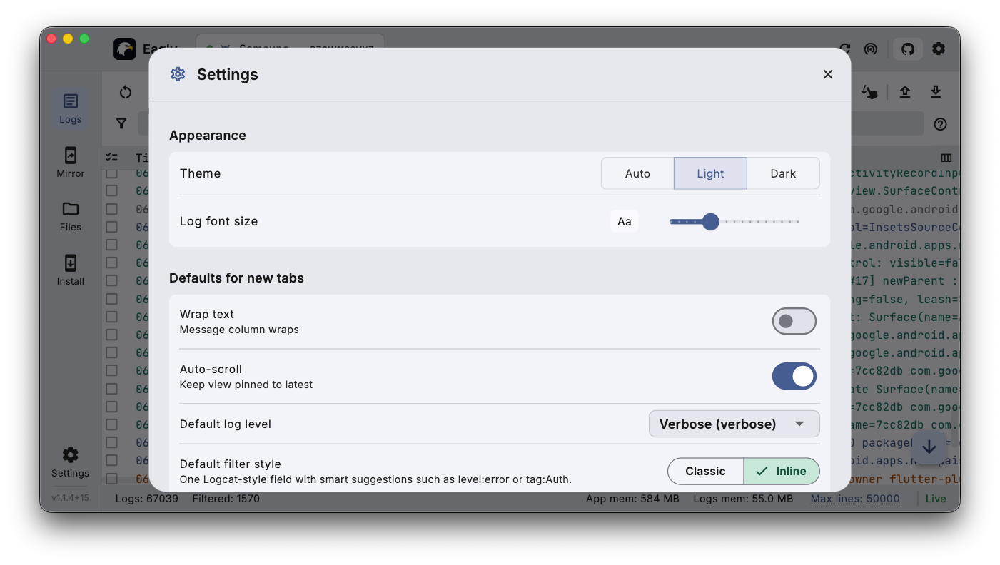

# Eagly - Universal Logcat and Console

A cross-platform desktop log viewer for **Android** and **iOS** devices — built for developers and testers who need a fast, reliable debugging utility to inspect device logs without any command-line setup.

---

## Screenshots

---

## Features

- 🔍 **Discover** connected Android and iOS devices automatically
- 📱 **Android** — stream logs via `adb logcat -v threadtime`
- 🍎 **iOS** — stream logs via `idevicesyslog`, with full multi-line syslog entry support
- 🔎 **Filter & Search** — filter by log level, tag, process ID, or free-text search
- 📂 **Import / Export** — open saved log files or export captured logs
- 🌐 **Wireless Debugging** — connect to Android devices over Wi-Fi
- 🎨 **Tabbed log sessions** — view multiple devices side by side
- 🛠️ **No external tools required** — `adb` and `libimobiledevice` are bundled in the app

### Roadmap

Future releases are planned to include:

- 📲 **Screen mirroring** — mirror device screen directly in the app
- 🖱️ **Device control** — interact with the device from your desktop
- And more developer/tester productivity features…

---

## Installation

For detailed changes and older versions; Refer [Releases](https://github.com/ShreyashKore/eagly/releases) page.

Download the latest release for your platform:

| Platform | Download |
|-----------|-----------|
| 🪟 Windows | [Download .exe installer](https://github.com/ShreyashKore/eagly/releases/latest/download/eagly-windows-setup.exe) · [Download .msix](https://github.com/ShreyashKore/eagly/releases/latest/download/eagly-windows.msix) |
| 🐧 Linux | [Download .deb package](https://github.com/ShreyashKore/eagly/releases/latest/download/eagly-linux.deb) |
| 🍎 macOS | [Download .dmg](https://github.com/ShreyashKore/eagly/releases/latest/download/eagly-macos.dmg) |

Eagly bundles all required Android and iOS communication tools, including adb and libimobiledevice. On Windows, iTunes must be installed for iOS device support.

---

## Usage

### Android

1. Enable **Developer Options** on your Android device.
2. Turn on **USB Debugging** (Settings → Developer Options → USB debugging).
3. Connect your device via USB (or use wireless debugging).
4. Launch Eagly — your device should appear automatically.

### iOS — macOS / Linux

1. Connect your iPhone or iPad via USB.
2. When prompted on the device, tap **Trust This Computer** and enter your passcode.
3. Launch Eagly — your device should appear automatically.

### iOS — Windows

> **iTunes is required** for iOS device communication on Windows.
> Download and install iTunes from [https://www.apple.com/itunes/](https://www.apple.com/itunes/) before connecting your device.

1. Install [iTunes](https://www.apple.com/itunes/).
2. Connect your iPhone or iPad via USB.
3. When prompted on the device, tap **Trust This Computer** and enter your passcode.
4. Launch Eagly — your device should appear automatically.

---

## Building from Source

First-time setup is scripted — run [`scripts/setup.sh`](scripts/setup.sh)
(on Windows, from Git Bash: `bash scripts/setup.sh`). See
[docs/SETUP.md](docs/SETUP.md) for prerequisites and details, and
[docs/CONTRIBUTING.md](docs/CONTRIBUTING.md) for the packaging flow.
