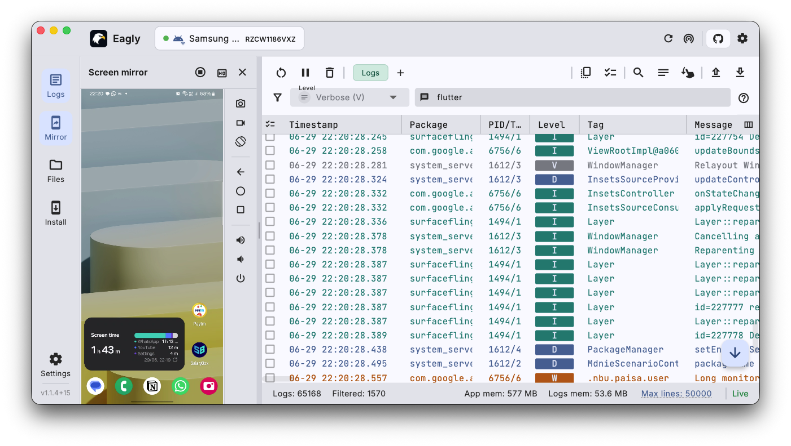
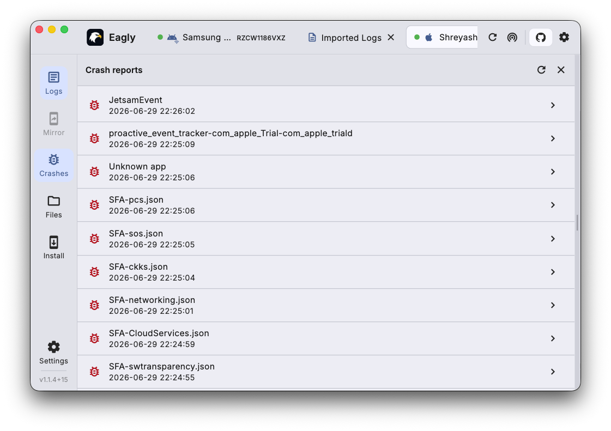
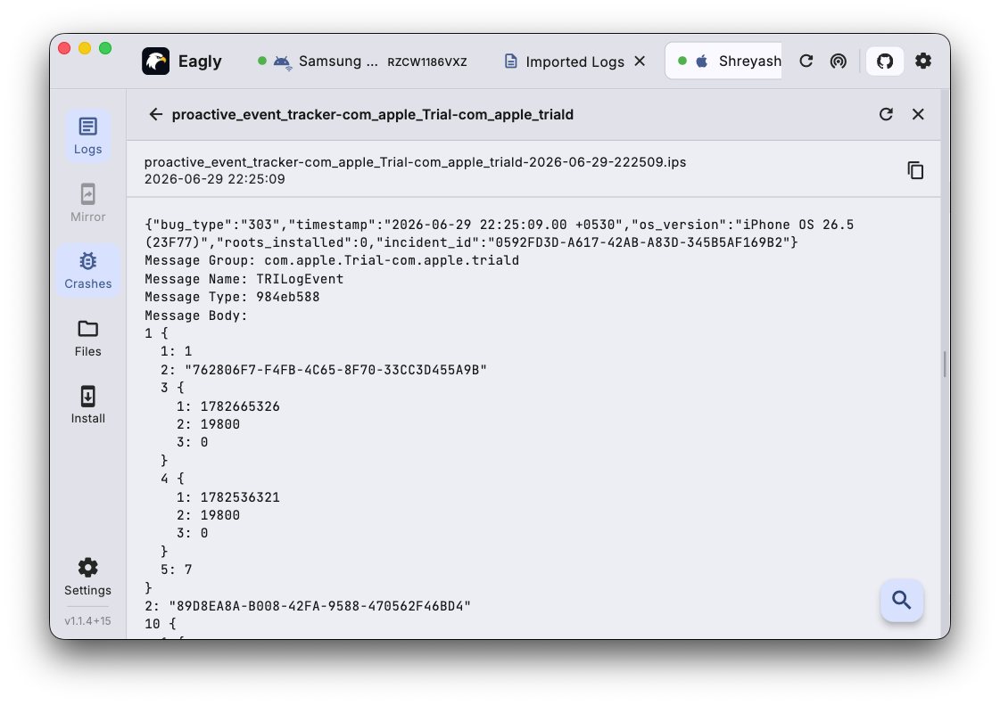
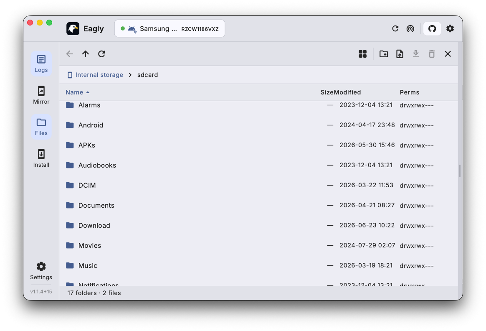
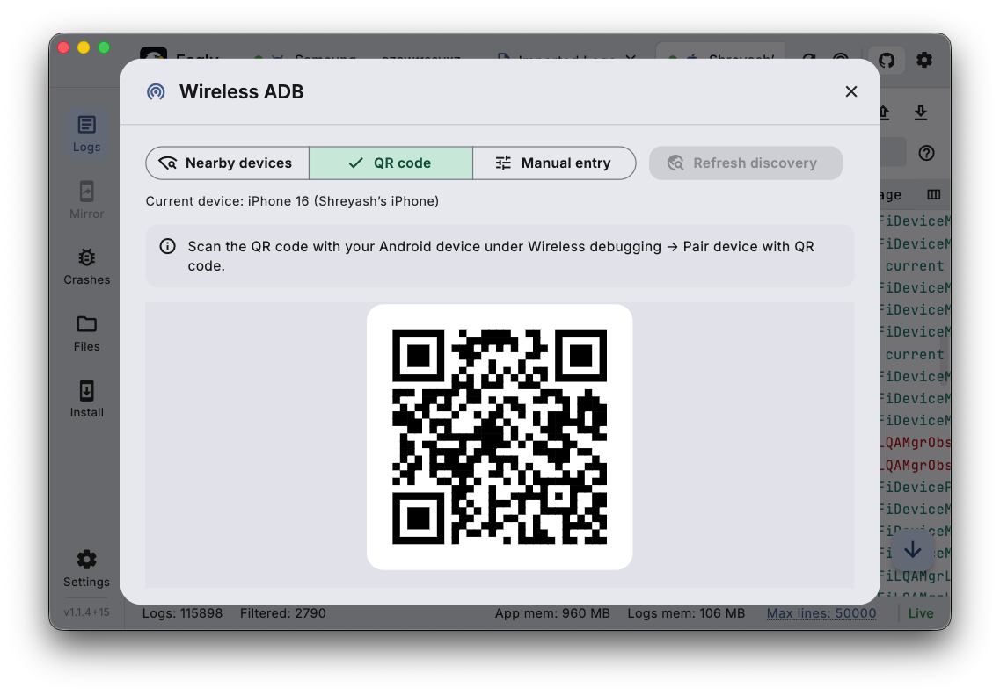
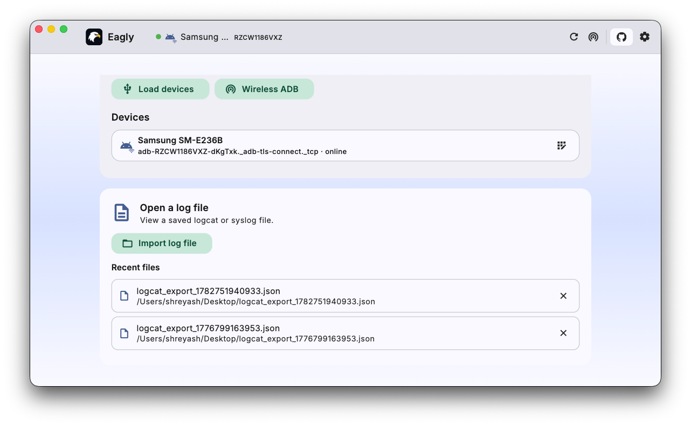

# Eagly — Universal Logcat & Console for Android and iOS

**Eagly** is a lightweight, cross-platform **desktop log viewer** for **Android** and
**iOS** devices. View **logcat** and **iOS device logs & crash reports** on **Windows,
macOS, and Linux** — no Android Studio, no Xcode, and no command-line setup required.
It works as a **universal ADB** and **universal logcat** console: stream live logs,
mirror and control the screen, browse files, read iOS crashes, and install apps. `adb`
and `libimobiledevice` come bundled, the whole app is **under 50 MB**, and it stays
light on memory.

**Jump to:** [Download](#download) · [Why Eagly?](#why-eagly) · [Features](#features) · [Screenshots](#screenshots) · [Usage](#usage) · [Build from Source](#building-from-source)

---

## Download

<table>
<tr valign="top">
<td align="center" width="33%" valign="top">
<a href="https://github.com/ShreyashKore/eagly/releases/latest/download/eagly-windows-setup.exe">
 
<b>Windows</b>
</a>
  
<a href="https://github.com/ShreyashKore/eagly/releases/latest/download/eagly-windows-setup.exe"><b>⬇ Download .exe</b></a>
 
or the <a href="https://github.com/ShreyashKore/eagly/releases/latest/download/eagly-windows.msix">.msix</a> package
  
⚠️ For iOS device support, also install <a href="https://www.apple.com/itunes/">iTunes</a> or <a href="https://apps.microsoft.com/detail/9np83lwlpz9k">Apple Devices</a>
</td>
<td align="center" width="33%" valign="top">
<a href="https://github.com/ShreyashKore/eagly/releases/latest/download/eagly-macos.dmg">
 
<b>macOS</b>
</a>
  
<a href="https://github.com/ShreyashKore/eagly/releases/latest/download/eagly-macos.dmg"><b>⬇ Download .dmg</b></a>
  
⚠️ Apple Silicon (M1–M4) and your iPhone isn't showing up? Update to <b>1.2.2 or newer</b> — no Rosetta needed
</td>
<td align="center" width="33%" valign="top">
<a href="https://github.com/ShreyashKore/eagly/releases/latest/download/eagly-linux.deb">
 
<b>Linux</b>
</a>
  
<a href="https://github.com/ShreyashKore/eagly/releases/latest/download/eagly-linux.deb"><b>⬇ Download .deb</b></a>
 
Debian / Ubuntu based distros
</td>
</tr>
</table>

For all versions and changelogs, see the [Releases](https://github.com/ShreyashKore/eagly/releases) page.

Every build is **under 50 MB** and runs with a low memory footprint. Eagly bundles all
required Android and iOS communication tools, including `adb` and `libimobiledevice`, so
there's nothing else to install. **On Windows, iTunes must be installed for iOS device
support.**

---

## Why Eagly?

- 📱 **View iOS logs and crash reports on Windows** — inspect iPhone & iPad device logs
  and crashes without owning a Mac.
- 🔁 **One universal logcat / ADB console** — the same log viewer and workflow on
  **Windows, Ubuntu / Linux, and macOS**.
- 🚫 **View logs without Android Studio or Xcode** — read live device logs and crashes
  without installing heavyweight IDEs or SDKs.
- 🪶 **Small & efficient** — **under 50 MB** to download and a low memory footprint, so
  it launches instantly and stays out of the way while you debug.

---

## Features

| | |
|---|---|
| 📲 **Screen mirror & control** | Mirror an Android device's screen in-app and drive it with mouse & keyboard. |
| 🔍 **Live logs** | Stream Android (`adb logcat`) and iOS (`idevicesyslog`) logs with full multi-line support. |
| 🔎 **Filter & search** | Filter by log level, tag, process, or free-text — plus regex search. |
| 🐞 **iOS crash reports** | Browse and inspect crash logs pulled straight from connected iPhones & iPads. |
| 📂 **File manager** | Browse, upload, download and delete files on Android (single-level browsing on iOS). |
| 📦 **Install apps** | Drag & drop an `.apk` (Android) or `.ipa` (iOS) onto the window to install. |
| 🌐 **Wireless debugging** | Connect to Android devices over Wi-Fi — no cable needed. |
| 🗂️ **Import / export** | Open saved log files in dedicated tabs or export captured logs. |
| 🎨 **Tabbed sessions & themes** | View multiple devices side by side, with light and dark themes. |
| 🛠️ **No external tools** | `adb` and `libimobiledevice` are bundled — nothing to install separately. |

---

## Screenshots

### 📲 Screen mirroring & control — *Android*
Mirror the device screen right next to your logs and control it with your mouse and keyboard.

### 🔍 Live logs
Fast, colour-coded streaming with timestamps, package, PID/TID, level and tag columns.

### 🔎 Filtering & regex search
Narrow down noisy logs by level, tag or process, and find anything with regex search.

| Filtering | Regex search |
|---|---|
| <video src="https://github.com/user-attachments/assets/a93d115b-8899-4c03-895c-3aa0f33dec17" width="400"></video> | <video src="https://github.com/user-attachments/assets/10971f7b-a0a0-418b-a0b7-c70c43b9b77b" width="400"></video> |

### 🐞 iOS crash reports
Pull and read crash logs from connected iPhones and iPads.

### 📂 File manager — *Android*
Browse the device filesystem; upload, download and delete files.

### 🌐 Wireless debugging
Pair and connect to Android devices over Wi-Fi.

### 🗂️ Import logs
Open previously saved log files in their own workspace tab.

### 🎨 Getting started & themes
A friendly landing screen and full light / dark theme support.

---

## Usage

### Android

1. Enable **Developer Options** on your Android device.
2. Turn on **USB Debugging** (Settings → Developer Options → USB debugging).
3. Connect your device via USB (or use wireless debugging).
4. Launch Eagly — your device should appear automatically.

### iOS — macOS / Linux

1. Connect your iPhone or iPad via USB.
2. When prompted on the device, tap **Trust This Computer** and enter your passcode.
3. Launch Eagly — your device should appear automatically.

> **Apple Silicon Mac (M1 / M2 / M3 / M4) and your iPhone never appears? Update Eagly.**
> Builds **before 1.2.2** bundled Intel-only (x86_64) iOS tools, so on Apple Silicon they
> needed **Rosetta** — without it, iPhones and iPads simply never showed up, with no error.
> **1.2.2 fixes this:** the bundled `libimobiledevice` tools are now universal
> (arm64 + x86_64) and run natively, so **Rosetta is no longer required**.
> Grab the [latest release](https://github.com/ShreyashKore/eagly/releases/latest) and
> reconnect your device. (Your current version is shown under **Settings → About → Version**.)

### iOS — Windows

> **iTunes is required** for iOS device communication on Windows.
> Download and install iTunes from [https://www.apple.com/itunes/](https://www.apple.com/itunes/) or [Apple Devices](https://apps.microsoft.com/detail/9np83lwlpz9k) before connecting your device.

1. Install [iTunes](https://www.apple.com/itunes/) or [Apple Devices](https://apps.microsoft.com/detail/9np83lwlpz9k).
2. Connect your iPhone or iPad via USB.
3. When prompted on the device, tap **Trust This Computer** and enter your passcode.
4. Launch Eagly — your device should appear automatically.

---

## Building from Source

First-time setup is scripted — run [`scripts/setup.sh`](scripts/setup.sh)
(on Windows, from Git Bash: `bash scripts/setup.sh`). See
[docs/SETUP.md](docs/SETUP.md) for prerequisites and details, and
[docs/CONTRIBUTING.md](docs/CONTRIBUTING.md) for the packaging flow.

## Contributions

